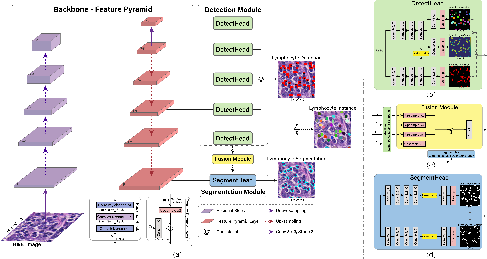

# DDTNet: A Dense Dual-Task Network for Tumor-infiltrating Lymphocyte Detection and Segmentation in Histopathological Images of Breast Cancer

This project hosts the code for implementing simultaneous Lymphocyte Detection and Segmentation: [Paper](https://www.sciencedirect.com/science/article/pii/S1361841522000676)

    Xiaoxuan Zhang, Xiongfeng Zhu, Kai Tang, Yinghua Zhao, Zixiao Lu, Qianjin Feng,
    DDTNet: A dense dual-task network for tumor-infiltrating lymphocyte detection and segmentation in histopathological images of breast cancer,
    Medical Image Analysis, Volume 78, 2022,
 

Implementation based on [FCOS](https://github.com/tianzhi0549/FCOS).

## Installation
This DDTNet implementation is based on [FCOS](https://github.com/tianzhi0549/FCOS) and [maskrcnn-benchmark](https://github.com/facebookresearch/maskrcnn-benchmark). Therefore the installation is the same as original FCOS and maskrcnn-benchmark.

Please check [INSTALL.md](INSTALL.md) for installation instructions.
You may also want to see the original [README.md](FCOS_README.md) of FCOS and [README.md](MASKRCNN_README.md) of maskrcnn-benchmark.

## Dataset
+ Download BCa-lym dataset (H&E images and original manually annotated dots) from [here](https://www.andrewjanowczyk.com/use-case-4-lymphocyte-detection/)

+ Download Post-NAT-BRCA dataset (H&E images and original manually annotated dots) from [here](https://wiki.cancerimagingarchive.net/pages/viewpage.action?pageId=52758117#bcab02c187174a288dbcbf95d26179e8)

+ If you want to use your own dataset, the data should be prepared in the format:

```
project
│   README.md  
└───datasets
    └───lym
        ├──Images
        │  ├──001.png
        │  ├──002.png
        │  └...
        ├──ImageSets
        │  ├──Dataset Name1
        │  │  ├──train1.txt
        │  │  ├──test1.txt
        │  │  ├──train2.txt
        │  │  ├──test2.txt
        │  │  └...
        │  ├──Dataset Name2
        │  │  └...
        │  └...
        └──Masks
           ├──mask_001.png
           ├──edgemask_001.png
           ├──Dis_001.png       
           ├──mask_002.png
           ├──edgemask_002.png
           ├──Dis_002.png
           └...
```
Note:
1. Images should be H&E images (RGB images). If it is not *.png, modify [lym.py](fcos_core/data/datasets/lym.py). 
2. *.txt should include the names of all data in the training set or test set, for example, '001', '002', '003'...
3. mask*.png, edgemask*.png and Dis*.png are mask map, contour map and distance map corresponding to input image, respectively.
## Training
The following command line will train ddtnet_R_101_FPN_1x on 1 GPUs with Synchronous Stochastic Gradient Descent (SGD):

    python -m torch.distributed.launch \
        --nproc_per_node=1 \
        --master_port=$((RANDOM + 10000)) \
        tools/train_net.py \
        --config-file configs/ddtnet/ddtnet_R_101_FPN_1x.yaml \
        DATALOADER.NUM_WORKERS 2 \
        
## Inference
The inference command line:

    python tools/eval_net.py \
        --config-file configs/ddtnet/ddtnet_R_101_FPN_1x.yaml \
        MODEL.WEIGHT model_final.pth \
        TEST.IMS_PER_BATCH 4    

The Inference results include a list of bounding box coordinates, a mask map and a contour map for each input image. Use [Alignment.m](Alignment.m) to unify the detection and segmentation results.         
        

# Acknowledgments
We would like to thank [FCOS](https://github.com/tianzhi0549/FCOS) for overall framework.    
